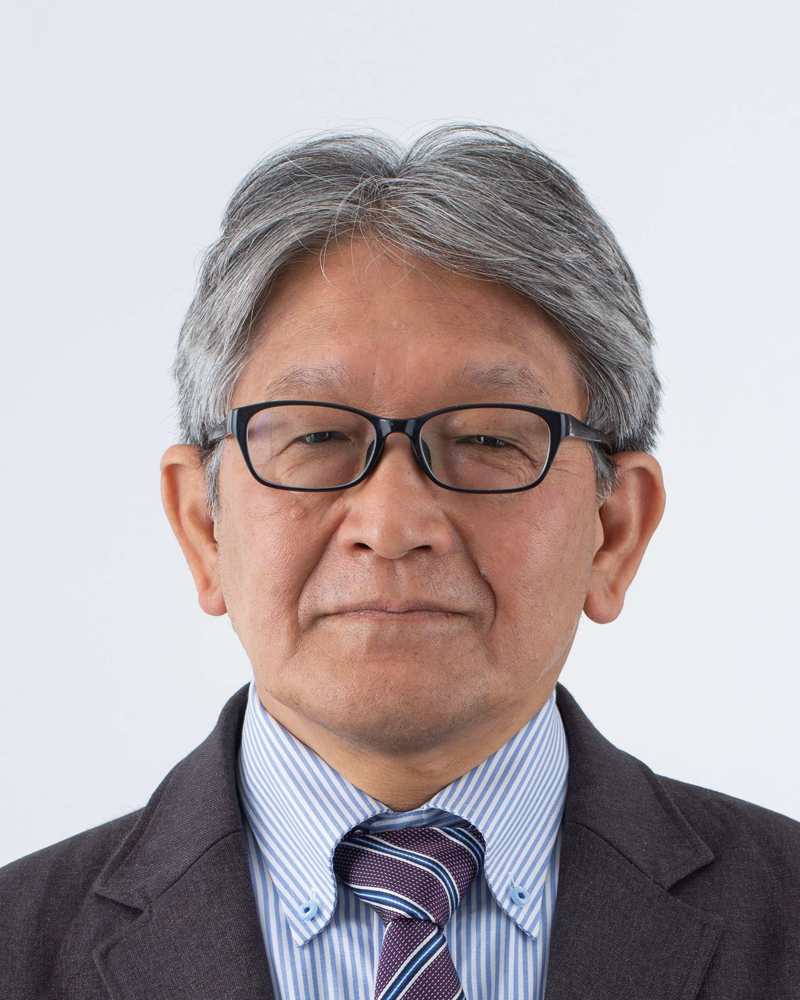

this is right

[Link to another page](./index-j.md).

<B> Mitsuhisa Sato, Ph.D</B>

- Division Director of [RIKEN Center for Computational Science](https://www.r-ccs.riken.jp/)
- Professor tive Graduate School Program) of [Department of Computer Science](http://www.cs.tsukuba.ac.jp/english/) [Graduate School of Systems and Information Engineering](http://www.sie.tsukuba.ac.jp/eng/)
- Fellow of [Center for Computational Sciences](http://www.ccs.tsukuba.ac.jp), [University of Tsukuba](http://www.tsukuba.ac.jp/english)

# Contact information 

:::note info
Mitsuhisa Sato,   
Divsion Director of QC-HPC hybrid platform Divison,  
RIKEN Center for Computational Science,  
7-1-26, Minatojima-minami-machi, Chuo-ku, Kobe, Hyogo, 650-0047, Japan  
Email: msato@riken.jp 
:::

# Research Interests

- Parallel Computing and High performance computing
- Parallel computer architectures and proramming models
- OpenMP compiler and programming
- Performance Evaluation and Benchmarking of parallel systems
- Low-power and power-aware computing
- Grid Computing
- Optimizing Compiler
